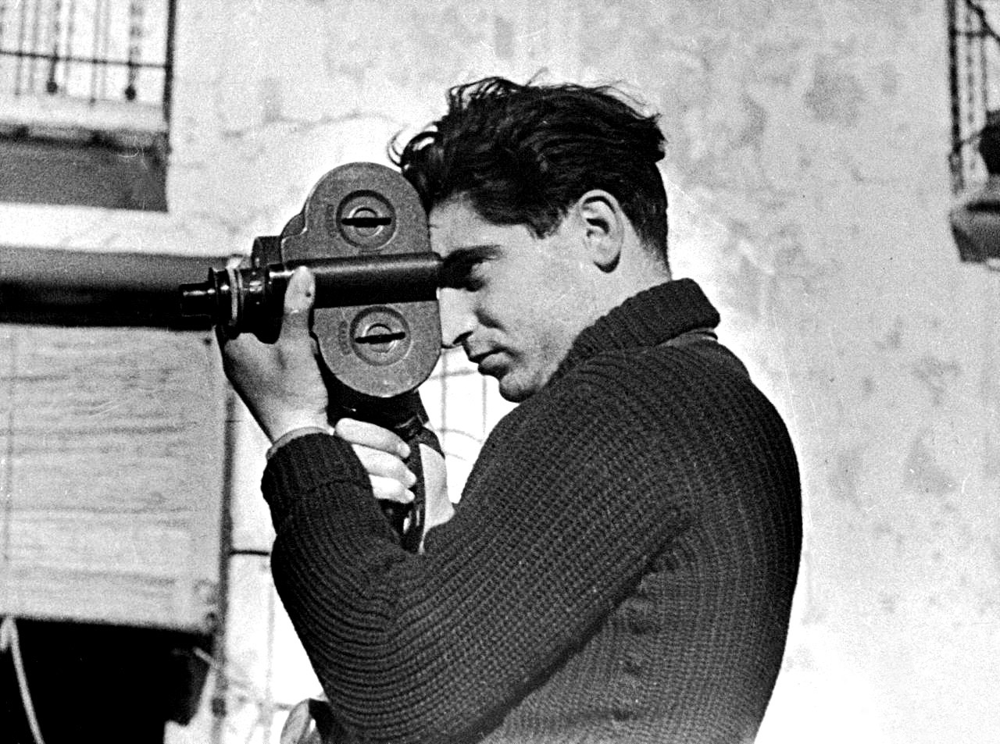

Musée de la liberation is one of my favourite museums in Paris. I've been here many times, and told everyone in my history class about it - it came in really useful for my last exam (topic: 'France during World War Two (1939-1945)'). If I have time before a Catacombs tour, I like spend some time here. Bonus, the permanent collection is free!

I did not know much about Robert Capa (1913 - 1954) before going into this exhibition, but my mother-in-law is a fan of his work so we went while she was in town. We wanted to buy tickets online, but they had already sold out their allotted online tickets. _But_ on the website it did say you could buy them directly at the museum but may have to wait. We arrived at 10:45 on a sunday morning and were able to get tickets to enter at 11:30. A 45 minute wait was fine with us, especially because of how much I love the permanent collection. I almost immediately left my partner and his mum and went to the section about the resistance fighters (my favourite section!).

### The exhibition

The exhibition breaks down the life of Endre Friedmann, later known as Robert Capa. Capa's works recounts tragedies of conflict, stories of refugees and death. He is often seen as one of the most influential war photographers of history - he was there, close to many combat and unfortunately lost his life at the age of 40 after stepping on a landmine while photographing the First Indochina War.

The name Robert Capa was invented to make his work more marketable. Originally both Capa and Gerda Taro (1910 - 1937), another war photojournalist, worked under the 'brand' Capa, so some his earlier works are wrongly attributed to him instead of Taro. Taro was his professional partner who later becoming a romanic partner. She unfortunately died in Spain during the Battle of Brunete. Despite Taro dying in Spain, she is buried in the Père lachaise cemetery in Paris! Want to learn more père lachaise? [Book a tour](/book/pere-lachaise/)!

> a photo of Robert Capa taken by Gerda Taro

I really enjoyed the exhibition, I spent almost one hour here. There is a second part to the exhibition where they show a video (in French). I did not stay to watch this, but maybe I'll find the time to go back.

Here are some of the things that stood out to me.

Throughout the exhibition they have panels that give some context to the period of Capa's life and the progression of his career. One of my favourite panels was **the manipulation of photographs**. I really like this because it remains true today. The angle of the photo, how you chose to crop it and what you're focusing on can and does change the meaning of a photo.

> The relationship between photography and "truth" has been questioned since the birth of the medium. While photography represents reality, that reality can also be manipulated.

**Photography is an art**, and it's something that I take for granted today. I walk around almost everywhere with a camera in my bag in the form of a phone. It takes no skills to take a photo on a phone (note, that says nothing about the quality. I take some _awful_ photos). Aim your camera, click a button and voila, you have a photo! But that hasn't always been the case. This is especially to important to note in a war zone when seconds really do matter.

His political views were always important to him. He stopped working with media distributors when his political view were no longer aligned. He later became responsible for over overseeing the distribution of his own images to ensure they were not modified - magazines reserved the right to crop images and alter captions which can so easily change the tone or meaning of the photograph which he wanted to avoid.

Another thing that I found interesting was the way the exhibition didn't paint him work only is a positive light. They acknowledge that some of his famous photographs may not actually be what they were initially thought to be. Like in the case with the photo _The Falling Soldier_, recent theories suggest that this was actually a staged photo and not a photo taken in battle. Another example is the amount of photos he took on the D-Day landing in June 44. He said he had taken 100, but the majority of them got corrupted. However, recent evidence suggest he didn’t actually take this many photos.

Some of my favourite photos in the exhibition were photos Capa took during the liberation of Paris. The liberation of Paris is an event that I talk about often on tours because of how France was impacted during World War Two. Seeing the photos he took is one thing, but know I have walked the same streets is another thing Paris. There's a video playing that shows Capa during the Liberation. In the permanent collection of the museum you can see photos of giant Nazi flags hanging on the side of buildings in Paris. These photos always shock me, because of having passed the same places so many times.

### Practical info

- 🎟️ tickets cost 11€ (reduced rate 9€)
- 🇬🇧 all of the main text has been translated into English (which is also the case for the permanent collection)

The exhibition was busy, but they managed the flow of people fairly well. Every few minutes, they'd let in another few people so that you actually had time to read the text.

I really like that there's the option of buying tickets on the day even if they're sold out online. This is not something I see often in Paris. If you are unable to buy tickets online, I would recommend going earlier in the day because the exhibition can _really_ sell out.

### Want to get in contact?

If you have been to this exhibition, I'd love to know what you thought! You can send me a message on Instagram at **[@abi.in.france](https://www.instagram.com/abi.in.france/)**

