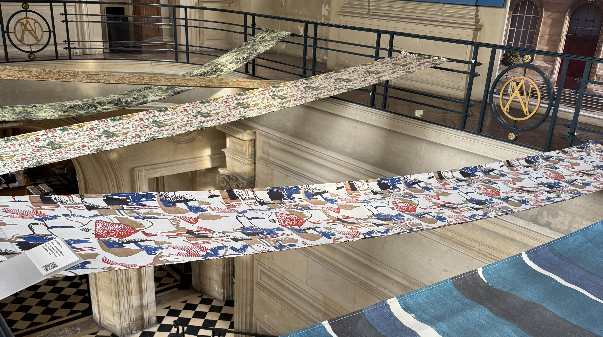
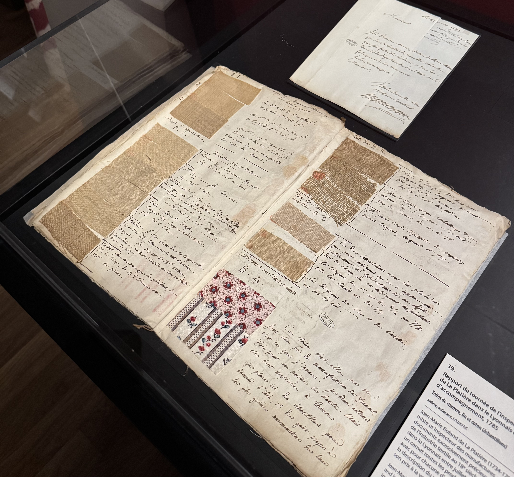
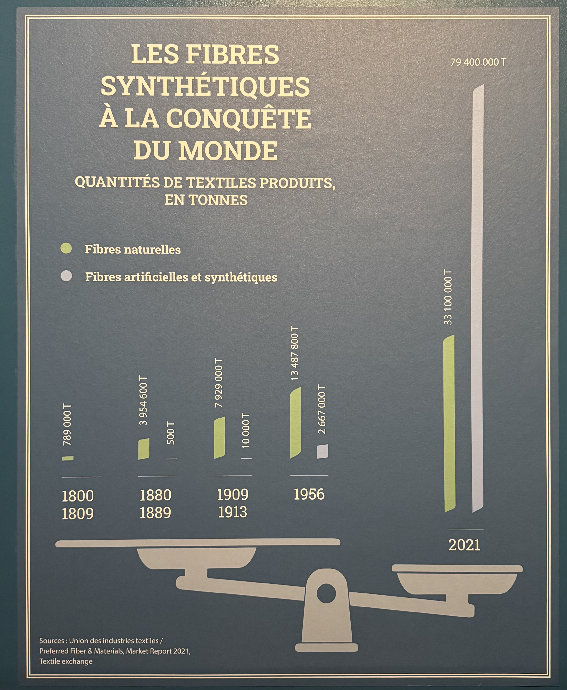

I came across this exhibition while walking through Le Marais a few weeks ago and I knew that I wanted to visit. So in typical me fashion, I went on the closing week and I'm very happy that I got to see it (but next time I'll try and not leave it until the last minute).

I don't often think about the history of textiles, but I know they now have a massive impact on the environment which is why I buy mostly second-hand. It was interesting to learn about the history within France.

The exhibition is free, and I spent around 1h30 here.

### The exhibition

As you walk into _Hôtel de Soubise_ you'll see that the pillars have been decorated. From a distance, it looks like a photo but it's actually fabric. I love details like this. The exhibition is on the first floor, and as you go up the stairs, you'll see there's fabric draped across.

The exhibition is broken down into four main themes, _the invention of French quality_, _ruptures_, _Industrial Revolution_, _commerical revolution (1814-1914)_ and ending with _globalisation_.

At the start of the exhibition, there's a section on different materials (linen, cotton, wool, silk, artificial and synthetics) with a small description of each. This text is only in French, but most of the exhibition has translations. Under each material there's a sample that you're allowed to feel.

There's also a timeline that starts in 1665 that goes all the way up to 2024 which covers some of the big events such as the banning of certain fabrics, and rationing of textiles. In 2024 the label _ecobalyse_ has been introduced in France for all new clothing which measures the environmental impact of the item. (this timeline is only displayed in French).

#### 1. The invention of French quality

At the beginning of Louis XIV personal reign, textiles were the largest industry in France. However Jean-Baptiste Colbert believed that their quality fell short in comparison to foreign competitors so he introduced a policy which would reduce the import and increase the export. On the 13th August 1669 two general regulations were introduced related to drapery and dyeing. Other laws later followed such as the quality of raw material, dimension of the fabric and thread count. If the pieces was deemed to conform to the standards, they were issues a seal of approval.

Factory inspectors made on-site inspections. These inspections often involved keeping samples. In the exhibition you can see various books with textile samples and notes on them. I _love_ getting to see old books, they fill me with so much joy. Something from hundreds of years ago that still exists!

Along side the new regulations, they also wanted to promote French textiles. They did this by poaching highly skilled workers such as Josse van Robais who moved his machines and workers to France. Another example is Jacobite John Holker, a Manchester manufacturer who worked for France spreading English methods through the country. It's not surprising that espionage existed, but it's not something I had considered within the textile industry.

#### 2. Ruptures (1789 - 1815)

Guild and manufacturing regulations were abolished in 1791 in favour of free trade which had an impact on the textile manufactures. On top of this, they also had to deal with the loss of labour and shortage of raw materials caused by the Napoleon's Continental Blockage.

Despite the difficulties, the government made efforts to support technological innovations within the industry. Beginning in 1798, exhibitions of French industry products allowed the state to recognise and reward technical innovations.

#### 3. Industrial Revolution, commerical revolution (1815 - 1914)

The Industrial Revolution impacted the textile industry. Mechanical looms and spinning machines were invented, so work could be concentrated to large factories, artificial dyes and textiles appeared (which sometimes were dangerous for people's health). Arsenic was used to dye clothes, a nice colour, but I'll give that a pass.

It was during this period that the state started implementing regulations. A law passed in March 1841 prevented children under 8 and regulated working hours for adolescents. It was slow to implement along with regulations of toxic dyes.

Unfortunately, it's still very much an issue with how clothing is manufactured - people are exploited along the entire progress from growing the crops that produce the raw material to making the item. They're often forced to work long days with no breaks and are paid almost nothing for their work.

#### 4. French textiles and globalisation

There have been a few big events since the early 20th century that have had an impact on the textile industry from the First and Second World War, to the opening of the European Common Market in 1957 to the production of synthetic materials for clothes.

Below, you can see that both the natural fibers has increased by over 50% since 1956, but we're also producing _so much_ artificial and synthetic materials. There's no way we need to be producing so much.

While this might be obvious to a lot of people, I learnt the difference between _artificial_ and _synthetic_ materials. They _seem_ like they're the same but they're different. Artificial fabrics are made with fibers made from natural material whereas synthetic fabrics are made of of petrochemicals.

### Closing thoughts

I'm happy that I made the time to see this exhibition. I like that the exhibition was put together while thinking about the environment. I think it did a good job of balancing both the positive and negative parts of the textile industry within France. Producing textiles is an art form. I like that they included recent changes.

There are still a lot of changes we need to make on a global scale. I think it's important to acknowledge that fast fashion is produced by people working in horrific working conditions, who are exploited so that we can have cheap clothes that are not designed to last. This needs to change, and everyone can do their part.

Buy second hand, check the ethics of the company you're buying from, and put pressure on governments to enforce changes.
