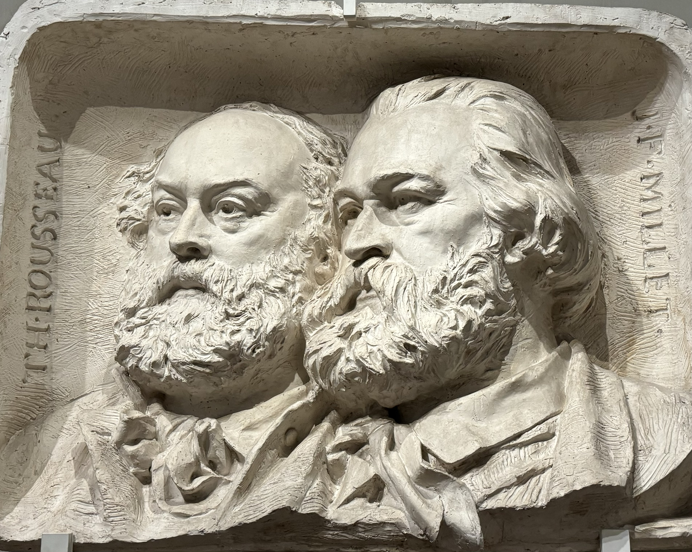

### Théodore Rousseau at the Petit Palais

This was my first time at the Petit Palais which is wild after over seven years in the city. There are just so many places to visit and not enough time.

This exhibition is devoted to Théodore Rousseau (1812 – 1867), a french painter who's primary focus was on nature. He was an influential artist at the time, but was also behind some big changes environmentally (in a good way!).

> His love of nature soon turned into a battle, and for this reason, he can be considered a true proto-ecologist: along with other artists and writers, Rousseau took a new look at the forest of Fontainebleau, which led to the protection of part of it under the name of the famous "artistic reserves" (1853), a first in a world in the throes of industrialisation.

Tickets to this exhibition are 12€, but it was free for me because it's including under my _Carte Paris Musées_. I've been tracking how much I've saved with the card [here](http://abisummers.com/articles/subscriptions/). Entry into the permanent collection is free.

### The exhibition

It took me an hour to see everything in the exhibition, so it's fairly small compared to some other I've been to recently. I actually prefer exhibitions of this size so that I don't lose focus midway through. I like to read the information in French first, followed by the English if there's any words that I didn't understand - which happens fairly often because my technical art vocab in French isn't great - so you could probably get through the exhibition in less than one hour.

The exhibition talks through some of his failures as well as his successes and the process behind some of his pieces. He worked outdoors as close to nature as possible before finishing the pieces in his studio - which could sometimes take years, and sometimes were never finished. It's unfortunate that capitalism requires us all to make money fast, so we don't have the option to spend two years working on a piece of art and doing things that feel good for us (that's my feelings anyway.

I really liked this exhibition, I like that a lot of the paintings has some additional context to go with it, everything was translated into English apart from the quotes on the walls. As someone who doesn't know a lot about specific periods of art, it's sometimes hard for me to understand the painting without the context so I'm always grateful when it's included. I didn't grow up going to museums, so appreciating art and finding my style is something that I'm working on. I don't often think about art in terms of evolution, on different trends through history but Rousseau aspired to paint the landscape for what it is, not just the backdrop, something which made him stand out at the time.

There was quite a lot of variety in his work, all with the theme of landscape and nature. Most were paintings but there were also some drawings. While I was there, there was someone sat drawing one of the pieces on display which I love to see. A lot of the paintings had an emotional connection behind, like trying to preserve the memory of a forest before all of the changes happen.

There was one [painting](https://co.pinterest.com/pin/519602875762981572/) on display _la descente des vaches dans le haut-jura_ which has unfortunately been badly damaged due to chemical processing. I'm grateful that so many pieces of art have been preserved. A close friend of mine, often tells me about the restoration process because that's what he's studying - it's super interesting to learn about it. There were two things that stood out to me, one being the size of the painting and the second being the red colour that has taken over.

Rousseau, originally from Paris, settled in Barbizon in 1847, a small town in Forêt de Fontainebleau. A 'colony' of artists later formed there, and it was made more accessible when the Paris - Melun train line opened. In the exhibition there's a section dedicated to other artists who lived in Barbizon at the same time. Barbizon is actually one of the places I had in mind for my Île-de-France project, but instead I went to [Bièvres](/articles/alphabet-ile-de-france/b-bievres/).

At the end of the exhibition, there's a timeline with some information about the forest of Fontainebleau. I have been to Fontainebleau a few times before, but I've never thought about how important of a place it was for artists at the time and environmentally.

### Closing thoughts

I enjoyed this exhibition a lot. It was interesting to think about how at first glace the landscape paintings can look fairly simple, but when stopping to think about it there's many different layers to the piece - what time of year was it painted at, where is the sun, what is the story behind the location choice. It takes time to perfect a craft. When it comes to creating things, I often rush the process and often give up if I'm not good at something straight away. But it takes, time, patience and persistence to follow through with an idea.

Rousseau sounds like a very influential man, who did a lot for landscape art but also environmentally. He wrote letters to prevent the damage to the Fontainebleau forest, something that we can still enjoy today. It's nice to know that art can make a difference. I know that when I'm next there, Rousseau is someone I'm going to think about.
