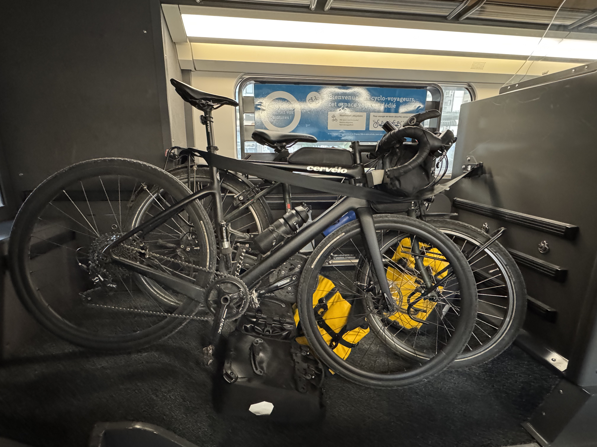

I spend a lot of time on trains, it's something I really enjoy. I also love travelling by bike, and sometimes I take my bike on a train. Here's my guide on how to do it without putting it in a bag.

This article is going to focus on the two main types of trains in France - the TERs (transport express régional) and the TGVs (train à grande vitesse).
<!-- 
Some good to know French terms:

- vélo: bike
- velo non demonte: non disassembled bike -->

### Booking a ticket

I always use the SNCF app or website. This _should_ be easy, however the SNCF platform sucks for booking a train with a bike. There's the easy mode of a direct TGV with bike storage to your final destination but that's usually not the reality. Often you'll need to take multiple trains or a TER. Essentially the app doesn't show all of the options to get to your destination because you don't need to reserve a ticket for TERs therefore doesn't show the option. Sigh, I really hope they change this behaviour.

So here's an example, say, I want to go from Paris to _Boulogne Ville_ with my bike. If I search on the SNCF app with the bike option added then it will tell me it's not possible. _However_ if I remove the option I will see that there are lots of trains going there including some TERs. So the next step is to verify if the specific TER accepts bikes - you can do this by searching the TER followed by the train number (so _TER K16_ for Paris to Boulogne Ville). It will usually take you to the region that runs the train and there you can find all the information you need.

If you have bought a ticket through the app with the bike option and need to change it double check that the bike option is still included on your ticket. I've had the issue before where the bike option has been removed, so I've had to go to a SNCF help desk inside a station to rechange the tickets to include the bike option. This is probably related to how the seat assigning works.

### TGV

This is my preferred way to travel because it's faster and because it's a guaranteed place for your bike. You do need to reserve a ticket in advance which costs 10€ per person (yes, even if there's only one person with a bike _everyone_ has the bike option added). At some stations, they will ask you and check your bike ticket before letting you onto the train, so it really is a risk to just show up and hope you'll be allowed on. You'll know exactly where you need to be on the train because you have an assigned coach. In my experience, the bike places are always directly next to your seats.

### TER

This is often the only route, because not all TGVs accept bikes and you're not always wanting to go to a big city. I've never had an issue with my bike on a TER however it does sometimes make me a little nervous especially when there are a lot of other people with bikes getting on the train for two main reasons: if there are too many bikes you _could_ be turned away (I've never seen this happen) and because a lot of people don't know how to use the bike storage properly.

There are two main types of bike storages on a TER. You have the places to hang up bikes, and areas to put bikes next to each other. My preference for this is to hang them because you can fit more and because it's easier to get your bike out if you're getting off before everyone else. _However_ if the person who gets on first doesn't hang up their bike it can cause issues for everyone else. Any luggage you have on your bike, should be removed before storing it.

My advice for travelling with a bike on a TER is:

- **arrive with plenty of time**: this is going to seem obvious, but it's important. Getting around a station with a bike always takes a little longer than without one. If you have a loaded bike, you might need to wait for the lift rather than taking the stairs
- **ask a member of staff where the bike storage will be**: depending on the train, there might only be one area for bikes and you don't want to be at the wrong end of the train because often a train will only be there for two or three minutes. Some trains have steps to get on, so if the staff are aware you're travelling by bike they can place the ramp for you. They can also announce where on the platform it will be.
- **be prepared for the different types of bike storage**: there are two main types of bike storage that I've seen on TERs. Sometimes, you'll need to hang your bike, other times you'll need to place it next to each other
- **ask when people are getting off**: this can be important to know when stacking the bikes next to each other. If you're going to be the first person to get off, you're going to want to make sure your bike is easy to access.
- **double check to make sure you don't need to reserve a space**: usually, you don't need to reserve a ticket for a TER however _sometimes_ it's required, usually in summer when they're expecting a lot of people to take their bikes. You don't want to be turned away!
- **be prepared to help others out**: if you have experience with taking your bike on the train, you can offer help to those who have less experience especially when it comes to hanging your bikes

I hope this article can help! Note, **this is a guide**, different train have different requirements and can change so it's worth also referencing the SNCF website for the most up to date information.

---
