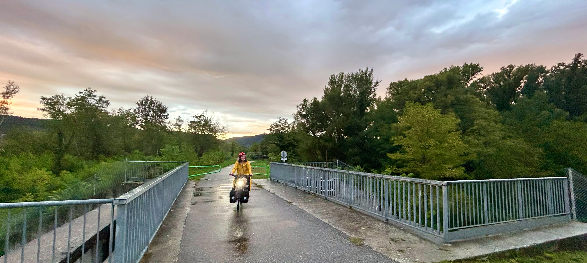
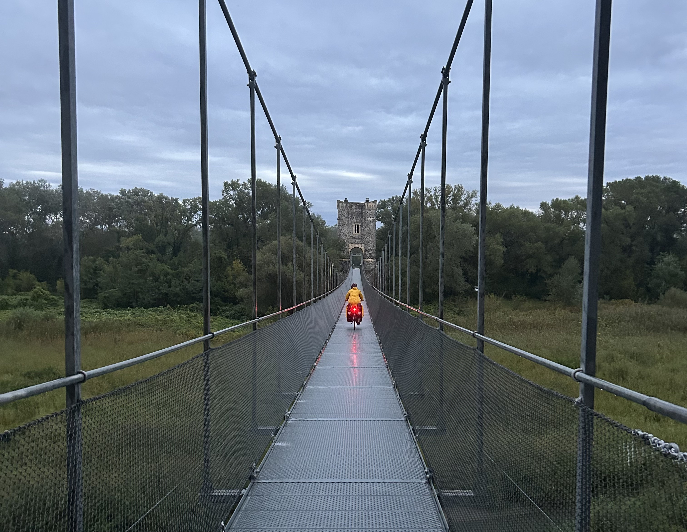
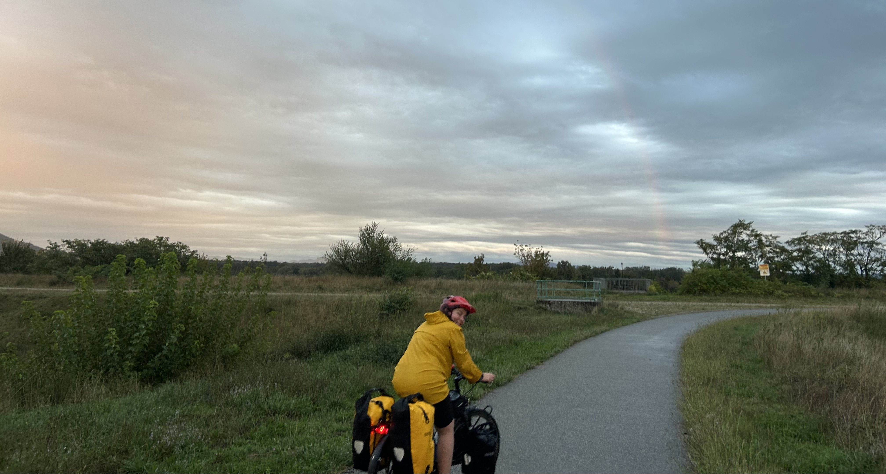
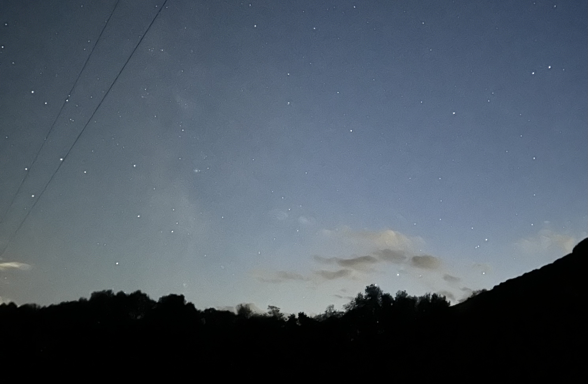

I love cycling for the most part - it's so freeing, it's good for my body and mind and bike packing is a conversation starter. The ride from Valence to Saint-Paul-Trois-Châteaux along the ViaRhôna, was 93km, one of my longest rides and we knew that the weather would not be ideal.

### Part one: Paris to Valence by train

26th September 2024

We started our day in Paris, taking a train from Gare de Lyon, down to Lyon, and then with a connecting train to Valence. We could have started the ViaRhôna in Lyon, but we didn't have the time for that - my partner had planned to do a 300km cycling event starting in Bollène on the 28th. He's really into cycling, he even created a [brevet finder](https://haroen.me/brevet-finder/) so he doesn't miss any that are close to us.

There were _two_ options suggested on the SNCF app that we considered. The first being a train that left before 6am which would have been hard for us to get to on time. And the second option left just before 12. We opted for the second train even though that would mean cycling in the dark. Cycling in the dark is ok if you're mentally prepared for it. It was a real toss up between a _really_ early morning and cycling in the dark.

At Gare de Lyon, there were two members of staff that asked if we had tickets for our bike - you _have_ to reserve tickets in advance for a TGV (if you're bike is not in a bag) - and only certain trains have the space for them. I imagine there are people who are unaware of this rule, or try to take their bike without a ticket anyway. The SNCF app _sucks_ for travelling with a bike because they don't show all of the options (a TER usually allows travelling with a bike, but will never show if you filter for bike). The nice thing about having a reserved ticket, is you're going to have the space for your bike. In my experience on TGVs, you're always sat just next to your bike which I like. I have been on TERs that did not have enough spaces for bikes where you can't reserve, which can be a frustrating experience.

Arrived in Lyon, we switched to a TER to Valence. This train was pretty busy, there were 6 bikes on the train! On this specific train, you had to hang up your bikes. We did not have to have a reservation for this, however during summer on weekends and holidays it's required on certain trains. We had some sandwiches on the train for lunch, and lots of snacks in our bags so we were prepared for the cycle!

The weather was not looking promising, lots of grey clouds and rain - exactly what was predicted.

### Part two: Valence to Saint-Paul-Trois-Châteaux

Technically Saint-Paul-Trois-Châteaux is not on the ViaRhôna, but it is where we decided to stay, which is ~10km off the route. We got off the train at Valence, loaded up my bike and then we were off! There were signs for the ViaRhôna as soon as we left the station both for the north and south direction. This was by far one of the easiest routes I've followed, there were signs the entire way including a small deviation. We followed the route the entire way apart from taking a small shortcut - it meant cycling on the road for a few km but that's something I'm ok with especially in smaller places, and the last 10km to where we were staying.

I knew that we'd have hours to go of cycling in the rain, so I fully embraced it. I will always try to avoid puddles but this time I was cycling through them - there was no way my feet would be dry by time I arrived. There's something carefree and childish about playing in puddles which I love. I was worried that the rain would ruin my spirits especially knowing we'd be cycling into the night, so we had a train in mind as a backup. But honestly, I had a great time. It also didn't rain the entire time which was a nice surprise!

One of my favourite things about travelling by bike, is getting to see places I otherwise would not have seen or even known about. One of the highlights was the _Vieux Pont de Rochemaure_ (the old bridge of rochemaure). This bridge was so cool, but also terrifying to cycle over especially because of the rain. There was a warning to not cross it during a storm because it's fully metal.

Another highlight was the nuclear power plant. I have never been this close to a power plant before - they're so so big. You could actually see the water stream down the sides after it condensed. It makes sense that there's a lot of nuclear power plants in this area because of the amount of water needed in the process. On one of the towers, there was a painting which looked cool.

The sunset was beautiful. Very rarely do I spend an evening outside with the time to watch the entire sun set. It was amazing getting to see all of the different colours of the sky, and how it was falling on the mountains. As the rain cleared up, and the sun was setting, we got to see a rainbow!

We didn't see that many people on the road, but that's probably because it's the end of September, on a Thursday afternoon while it's raining. I'm sure in summer this route is busy because it's really beautiful, it's protected from cars and it's easy to access with the train. As it was getting dark we did see one person setting up a tent on the route. And there was one person who we passed a few times - he must have been a local who had planned his own route because he kept on appearing behind us.

I loved this route! For almost the entire route, you are not sharing a road with cars, it's well signed, the scenery is beautiful even in the rain and I loved getting to watch the sky change colour as the sun set. We had a great view of the stars too!

Along the route, there were quite a few areas that can flood, there's a lot of signs for this and alternative routes when this happens. I would definitely recommend checking the weather forecast in advance.

In total, it took us just under 6 hours of cycling time, with an average speed of 16km/h. I'm a slow cycler, and that's ok with me.

### Part three: Saint-Paul-Trois-Châteaux to Avignon

The route we had planned was 73km. The first part of the route from Saint-Paul-Trois-Châteaux back to the ViaRhôna was not my favourite - we should have taken another route to get there but once we were on the ViaRhôna it was great.

The route was so well signed the entire way which is great. We were luckier with the weather this time, it didn't rain! It was rather windy which is something we had experienced over the day trips we did while in Saint-Paul-Trois-Châteaux _but_ this time it wasn't all headwind! Seriously cycling into headwinds is exhausting especially with a loaded bike.

The route was quiet, but again this wasn't peak season - a friday afternoon in October so it wasn't so surprising. I really enjoyed getting to talk to my partner while cycling because often when we're travelling the roads are too loud or too busy.

This part of the trip was faster than the arriving with my average speed being 18km/h, with the total cycling time being 4 hours. The increased speed makes sense - the weather conditions were better and it was a shorter side! 

### Part four: Avignon to Paris

We took a TER from Avignon to Lyon, and then a TGV from Lyon back to Paris.

We arrived at the Avignon station half an hour before our train was due to leave and I'm pleased we did. There was a lottttt of bikes getting on the same train as us. As soon as the platform was announced, we went to ask a SNCF member of staff where the bike storage on the train would be. He contacted the train driver to ask so we knew where to position ourselves on the platform. They even took out a ramp to help us get out bikes onto the train. Thankfully this train had a lot of bike storage, but it was a bit of a hassle because someone from an earlier stop has not hung their bike so it took more space than it should have.

We had almost an hour to change trains in Lyon, so we posted the postcards we wrote while on the train and went to a bakery for food on the train. The train back was quiet, and we were right next to our bikes. 

This experience inspired me to write an [article](/articles/travel/bike-on-a-train/) on travelling with a bike on a train - because parts of it can be stressful.

### Exchange stories

I would love to hear you stories of similar cycles that you have done! You can find my post on [Instagram](https://www.instagram.com/p/DAafdqyNr9W/?img_index=1) where I summarised my day! I loved cycling along the ViaRhôna and I would definitely recommend it to those who are starting with bike packing!

I would also love to know if you have any tips for cycling in the dark - it's something that I don't do often so am always a little nervous about the idea of it!
