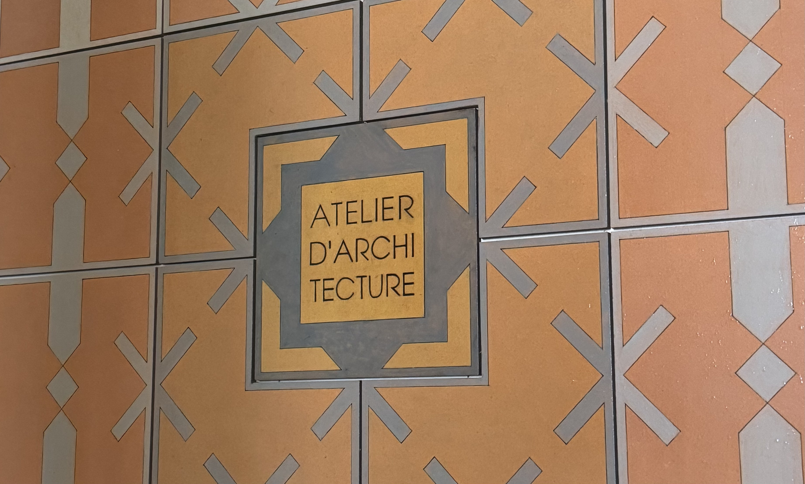
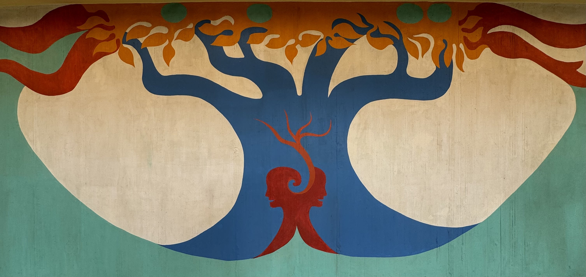
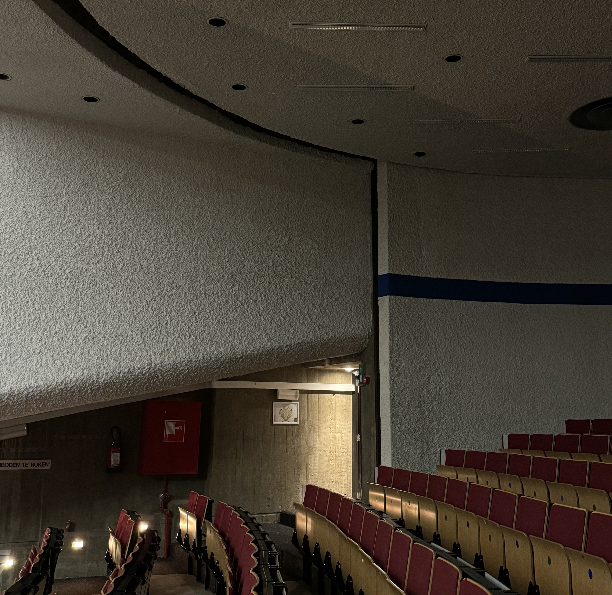
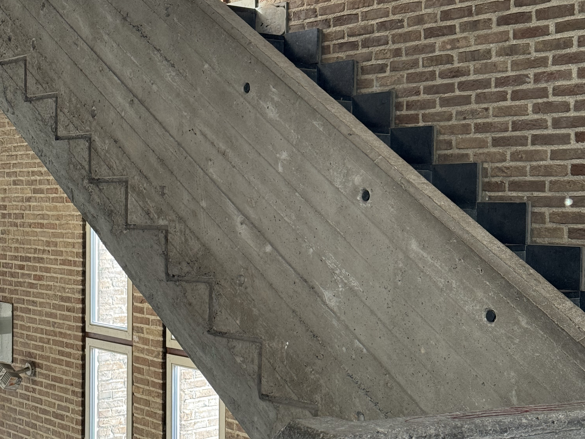

This year, I happened to be in Brussels at the same time as heritage days. In Belgium heritage days is split over three weekends - one weekend for the Dutch speaking part, one weekend for Brussels and one weekend for the French speaking part. I love heritage days, I think it's a really cool opportunity to visit places that otherwise are not open to the public, or are otherwise paid. My mother-in-law organised the tickets since she lives in Brussels. We went to visit four locations in total.

### Architect's house

The first place we went to visit was the house and office of an architect. This was super interesting. We followed a 40 minute guided tour. The architect lead the first part, followed by his wife, then two people from his architecture studio.

He spoke about the house, and some of the big changes that he made. They demolished garages that used to be in the garden and used those bricks in landscaping. There were some photos of the the construction.

He had a lot of passion about his vision (and execution). One of the things that really stood out to me, was he mentioned designing the space with children in mind. He said that modern architects rarely focus on space designed for children - and I agree with this. In his home, there was an upstairs area designed for his kids. From every direction, they could observe the adults - if the adults were in the dinning room, the living room, the kitchen or outside, they could be seen. In the dinning room, they had a low table so that it didn't obstruct the view which leads to open conversations.

His wife showed us around the garden. Their garden was beautiful, a real area for children to play. They has used some of the bricks, and stones from the road to create hills in their garden. He also had a seat in the garden attached to a tree - if you sit in the chair and are relaxed, it brings you higher, if you're stressed you're lowered to the ground. I would have loved to try it.

After the tour of the garden, we had a tour of their bedroom and kitchen lead by one of the architects at the company. Their bedroom had a bath inside it - something which you don't see often. The bath was specifically designed for them out of layers of wood, it was also designed in a way that uses the least water. The controls for the bath looks like stones, depending on the way you turned the stones, depends on where the water came from. It was very unique.

The kitchen is a key part of their home. It can be seen from multiple different rooms. It has been designed with real life use in mind - from the small table in there, you can reach both the stove, the sink and the fridge. You have access to all of the things you make need while cooking. The sink was a highlight - it was designed to be used, where you can access it properly, it had a small intent where you would stand.

After the kitchen, we moved into the architecture office area where another architect took over. This was cool to see. There were things that were specially designed - like the lamps above each desk, that had a small transparent shelf on them. This allows you to have access to the tools you need while working, while also being able to see what you're reaching for. He explained that colours are super important - having a white desk is important because it doesn't alter the colour of the things you're working on. Even the colour of your clothes alter how you perceive things. I really like thinking about colour theory.

### VUB (Vrije Universiteit Brussel)

We then followed two tours at the VUB. These tours were in Dutch - which I don't speak - however it was still a fun experience. I can get maybe ~10% of what's going on based on what I do know and context.

The first tour started in the office (Rectoraat) building of the VUB and took about 1 hour. The guide spoke about the vision of the architect, Renaat Braem. There were a lot of references to the shape of the building, the oval shape.

We walked up through all of the different levels. She explained a lot of the art through the building, what it was meant to symbolise. It was interesting to see the oval shape throughout the drawings. The architect did the paintings himself as the budget for artists had ran out.

One of the thing I really liked about the drawings, was how it was designed for the building. So things like light switches were part of the design. It was also interesting to see some of the sketches in the places where the paintings were not finished.

The second tour at the VUB was around auditorium Q. This was very cool - this is the first of its kind in europe. The auditorium is made up of one big room, and three smaller rooms. The smaller rooms can rotate to either be part of the big room, or be closed off and used independently. It was so cool being able to see where the rooms would rotate from - unfortunately we didn't get to see them rotate in person.

We also got to learn more about the temporary accommodation that was installed. It was originally only going to be used for three years, but some are still in use now 50 years later. Each block had it's own sanitation systems installed in a modular way.

### Ateliers Saint Luc

The final place we visited was an art university. The building on the outside is very different to the inside. They had guided tours throughout the day, in French, Dutch, English and Belgian French sign language. We followed the tour in French.

I really enjoyed this tour. I like learning about the smaller details that I would have otherwise missed. We got to see some of the different classrooms that are used - very few of the desks were suitable for left handed people (I'm a lefty so this is something that I often notice). Some of the smaller details I liked were the detailed lines you could see on the wall of the stairs.

I think guided tours offer a lot, but I really like when you can access places that are otherwise restricted. We were able to access the workshop on the top floor. This room had a very different feel, it was almost like we were in a different building. There was a lot of windows and light coloured wood.

### Final thoughts

I love heritage days, and I'm so happy that I was able to see four different things while in Brussels. Each of the tours left me thinking about something else - including the tours in Dutch. The Dutch tours really helped me understand what is it so be a good guide - and how information can be shared while not speaking the same language. The first tour was my favourite, because I like getting to see how people execute their ideas and I love listening to people with a passion talk.
