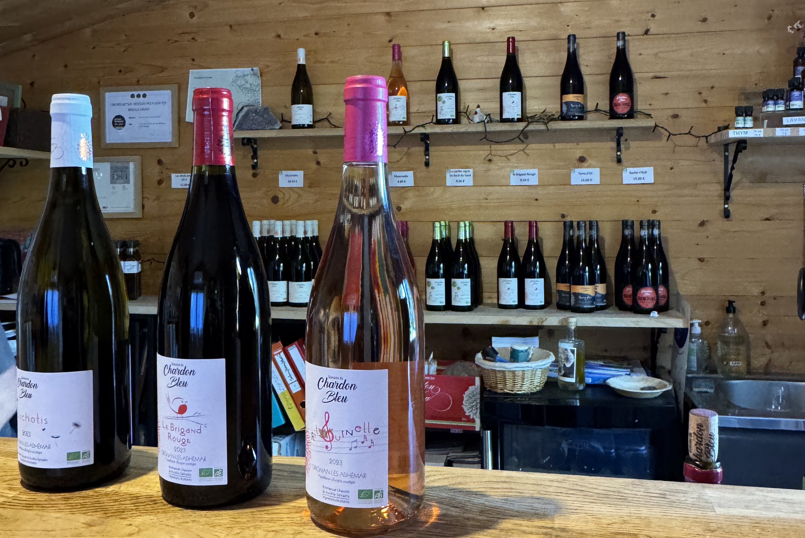
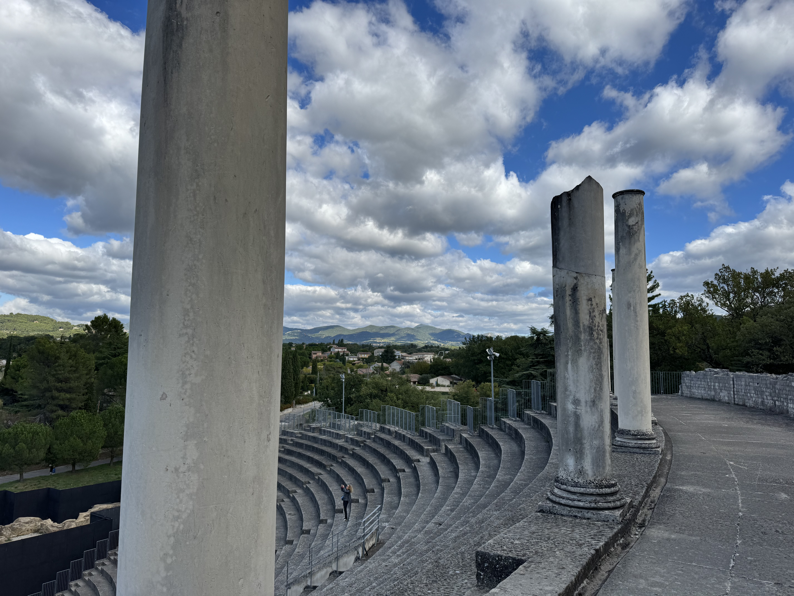
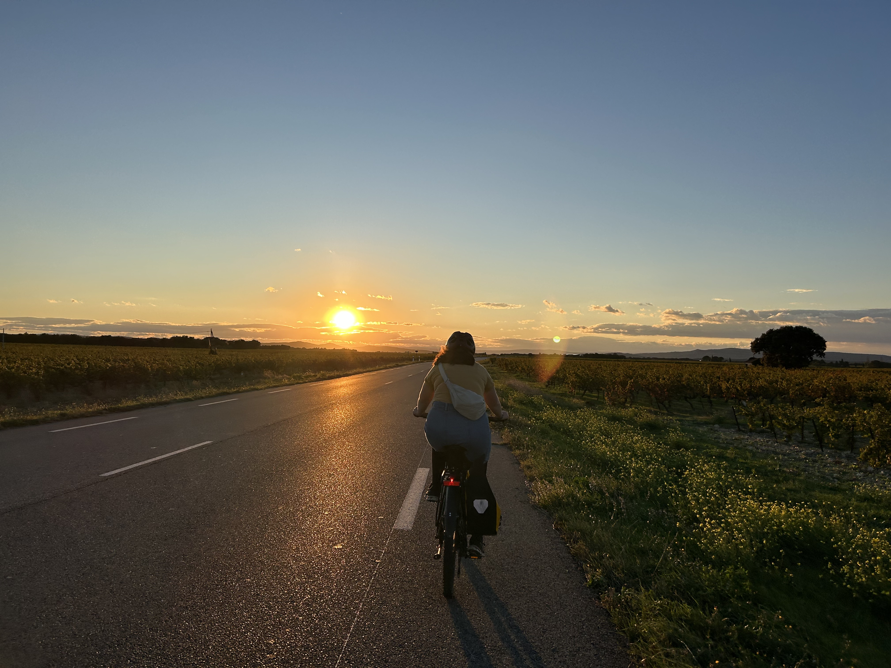

> Holiday from 26th September - 4th October 2024

This year, I didn't take any holiday during the July or August because I wanted to say in Paris for the [Olympics](/articles/olympics/) and [Paralympic](/articles/paralympics/) games - this was really a once in a lifetime opportunity for me. I don't follow any sport enough to travel for them, and for at least the next eight years, they're not going to be in Europe which would make getting there a lot more expensive.

So, at the end of September, I took 10 days off with my parter and we went to the south of France. We decided to stay in Saint-Paul-Trois-Châteaux because it was easy to get to - we too the train to Valence and then cycled along the ViaRhôna. But the main reason was because it's close to Bollène, where my parter had registered to do a 300km BRM.

I've wrote an [article](/articles/travel/cycling-the-viarhona/) on the cycle along the ViaRhôna, which I really loved. The weather was not in our favour, but I still had a great time. I think this is a great route for those who are new to bike packing.

### Saint-Paul-Trois-Châteaux

We picked this location because of where it was - it was easy to get to and close to Bollène. We rented an airbnb for a week which was great.

On our first day here, we walked around the town. We had lunch at _Le Comptoir des Arts_ which I really liked. We sat outside on the terrace and enjoyed the sun. We didn't really have a plan for our time in the south apart from the cycling event, so we took is slow. I love Paris, but it's a fast moving city.

We walked to the Lidl to get some food to start the week with. The Friday evening was an early night because my parter needed to wake up at 4am to get to the start of the BRM on time. I love going trying different restaurants but it's also important for me to have some home cooked meals while on holiday.

On the Sunday evening, we went out for dinner. We didn't reserve anything in advance, but we probably should have. There are not many places that are open on a sunday evening, and the first place we tried, _Restaurant La Chapelle_ was fully booked. We ended up in _L'Oxalis_ and it was so so good.

We had a starter, main and dessert with a bottle of local wine. When we arrived, the waitress asked if we had seen the menu because it's not typical French food - it's french food with an Asian twist. I guess they've had some people who were not a fan of the non french elements. They had two starters, three mains and three deserts to chose from. With my partner, we _always_ do 50/50 on meals so that we get to try everything (some people find this weird, I think it's great). I'm so happy we ended up here, the food was great, the staff were super friendly and I loved the vibe. We liked the wine so much, we actually went to the domaine to buy more of it!

While in Saint-Paul we also visited a wine bar in the centre called _Ôvins_. We sat outside on the terrace and had a glass of local wine and it was great.

### Day trip to Saint-Restitut & Suze-la-Rousse

On the Saturday I had a day to myself since my partner was cycling - I enjoy cycling but not 300km with +4000m of elevation. I planned a small bike ride to some towns close by - I found these towns on the [tourism page](https://www.ville-saintpaultroischateaux.fr/villages-alentours/) of Saint-Paul.

The first place I went to was Saint-Restitut. Saint-Restitut is a small town at the top of a hill. There's a lot of charm to this place - but not much to do there. I spent half an hour just walking an exploring the small streets. They did have one of the biggest open libraries that I've seen.

The second place I went to was Suze-la-Rousse to visit the château. There are so many châteaux in this region! It took about an hour to visit the château, they had a lot of things related to the history of wine, which makes sense because there's a university of wine here! While cycling, you really get to appreciate just how many vineyards there are in this area. There were a lot of things translated into other languages (at least in English, German, Spanish and Dutch). It cost 6€ to get in, but your ticket gets you discount on two other châteaux, Grignan and Montélimar as they're part of the châteaux de la Drôme.

At the château, they had a small exhibition on related to _jeu de paume_, real tennis. Inside this exhibition there's an interactive game where you can play real tennis by moving to the side in order to hit the ball. Just next to the château you can see the walls of an old jeu de paume court - one of the few still preserved in France.

### Day trip to Domaine du Chardon Bleu

After having a bottle of with with dinner in Saint-Paul, we decided to visit the domaine to buy more wine. We knew we wanted to visit a vineyard because how could we not?! We were surrounded by vineyards and I love wine. We had an entire day and we had bikes so we could go a little further. In total it was a 64km cycle! This is the further I've ever cycled for wine.

When there, we sat outside and had a small glass of wine. I wanted to try the rose. It was so nice to sit outside to enjoy the wine. We ended up buying a bottle of white, of rose and red. We drank the red wine while in our airbnb with dinner and the other two bottles came back with us to Paris which we'll save for some occasion (family visiting? cooking for friends?). For some reason, we like to buy heavy things to return with!

The cycle was beautiful, but the return was hard. There was so much headwind, which always takes so much more energy. I think if I had this level of headwind in the first 10km I would not have committed to actually going to the domain. I still loved our day trip and happy that we got to take some wine home! The two remaining bottles survived the 73km ride to Avignon, followed by two trains to get home!

### Day trip to Vaison-la-Romaine

This day trip was a 76km ride in total. The archaeological sites at Vaison-la-Romaine are open in the morning and afternoon with a close for lunch between 12:30 and 14h. We knew that realistically wouldn't arrive much before they closed for lunch break, so we didn't set off too early - it's a holiday after all! The route didn't involve so much climbing so we knew we'd have a few hours there in the afternoon before needing to head back (I don't overly enjoy cycling in the dark).

I am so pleased we got to visit here! This is the largest archaeological site in France. It was really really impressive to see the different sites - I've never seen anything close to this scale. There's such a contrast between the site, and the modern town that are just next to it. There's definitely parts of this site that are underneath where people are currently living which is wild to think about. I enjoyed getting to imagine how people were actually living as you were walking through the different rooms and outdoor spaces.

One of the highlights for me was the theatre. The steps down were incredible steep (I find walking down stairs hard because I don't have depth perception), but it was so impressive to see.

There are two sites just next to each other that are included in the ticket price, including the museum. We bought some postcards from the museum and souvenir shops. My step-dad is really into archaeology so I knew I had to send him a postcard!

After visiting the sites, we stopped for a drink and something small to eat at _Brassiere Kameleon_. They had a super cute dog who very much was interested in the _planche_ we had - he sat by our table while the food was there and disappeared when the food was gone. We then walked down towards the _Pont Romain_ (roman bridge) which was also beautiful to see. Then we went back to our bikes and cycled back to Saint-Paul! The headwind was strong, but the cycling was still fun. the sunset was incredible!

### Hiking

Close to where we stayed, is a beautiful hike. We started by walking up the old funicular route to the top of the quarry. There's nothing left of the funicular you can see where it used to run quite clearly because it's a straight line to the top. The quarry was cool to see, it's so big. I don't think I've ever walked through a quarry that was obviously a quarry - I've been to places including Parc des Buttes-Chaumont that used to be one, but has been transformed.

There are lots of different routes you can walk once at the top. We walked through the quarry, and then towards _Village troglodytique de Barry_. Along the way we passed a weather forecast station (I don't think I've ever been so close to one!) and some cool view points. It would have been amazing to watch the sun set from here, but the walk back down made me a little nervous. In Summer, I can totally imagine spending the entire night up there.

The Village troglodytique de Barry was cool to see.

We walked a slightly different way back, and went via the _Chapelle Sainte-Juste_. Again, the view from here was cool. There were some steep steps to get up, but it was worth it.

From here, we followed google maps to get us back into the town. In retrospect, we should have referenced a different map too. The route down from here was _steep_. So steep that it even had metal handles in the rock for your hands and feet.

So here's the thing, I'm not super comfortable with this type of thing, I have no depth perception so I'm always a little nervous about this. But at a certain point, I just had to commit. My partner was great, he helped me know where to put my feet and I was able to hold onto him when needed (which was a lot). I love spending time outdoors, but walking backwards down the side of the cliff makes me question if I'm really a city girl at heart.

### Final thoughts

There are so so many cute towns in this area. Getting around by bike is easy, but there are a lot of hills, which is not surprise based on the location. Some of the larger roads have a shoulder that they recommend cycling on, it's _almost_ a bike line but it would require some changes for it to be classed as one.

One thing I did notice is a lack of high street stores which is so surprising in a positive way. Almost everywhere I have visited there have been stores like h&mm and zara. I'm sure that people will drive to a nearby city if they need something, or order it online, but it's nice to not have the visible reminder.

I did really like how all of the restaurants seemed to be independently owned and were not part of a chain. I always try to avoid chains when travelling, but it's not always easy (the UK I'm looking at you). Restaurants in general seemed to be a bit more expensive compared to Paris for similar places however that's a price I'm willing to pay - and we were not disappointed once by the quality of food. I imagine it's much harder to have a sustainable business in a small town because there are less people and generally people will eat out less.
