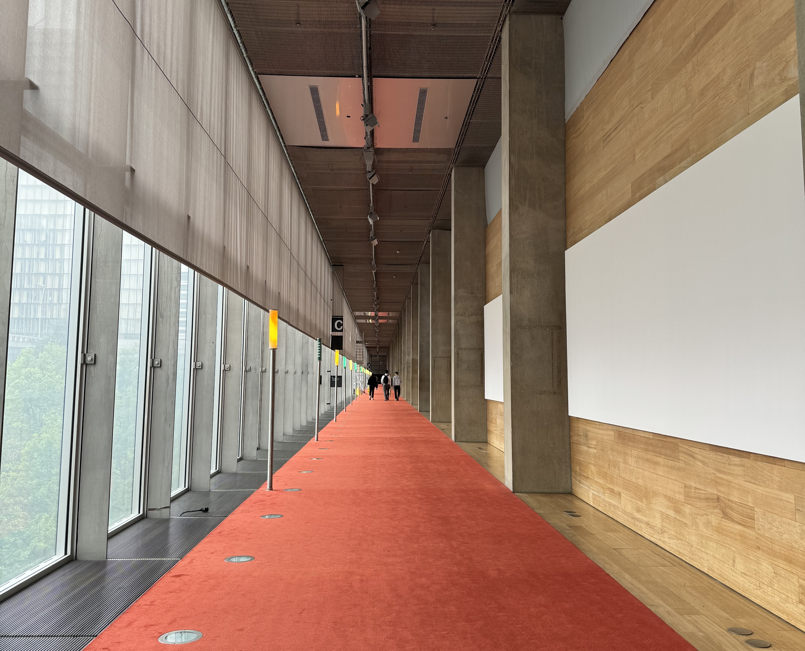
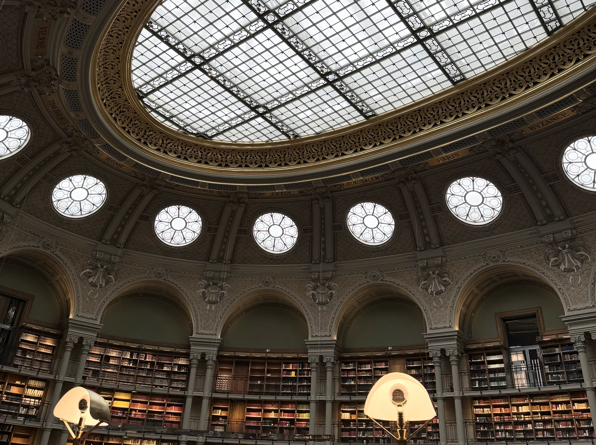

### Libraries in Paris

Since a lot of my job involves researching, I like to work from libraries. I feel like I'm more motivated if I'm not working from home every day of the week, especially if friends join me at a library. Co-working spaces can be nice, but the price of that adds up fast and I don't drink coffee (I prefer just drinking water, boring I know) and libraries are free.

I feel like most people will just go to whatever is closest to where they live, but I enjoy getting to see different parts of Paris and the change helps keep me motivated and different libraries have different benefits. I'm only including libraries that I've been to but I will keep updating this article as I visit new places.

Libraries are great places to get inspiration from and they're great places to learn - often libraries will host various workshops as well as having books on so many topics.

> Bibliothèque nationale de France: François-Mitterrand

### City libraries

There are the places that are ran by the city and are free to access even without a library card. There are 57 libraries in Paris, with multiple per arrondissements. It's really easy to get a library card if you live in France - you just need to ask at the desk, there's a short form to fill in. You need to have a valid form of ID with you (I used my british driving license).

Most of these libraries are closed on sundays and mondays, and they have different opening hours depending on the time of year (like a modified schedule for summer).

#### Médiathèque de la Canopée (1er)

This library is super central - just above Les Halles, located at level 0 of Westfield-Forum des Halles. I've walked past this place countless times (often outside of their opening hours) and I had no idea that it was here. They have a few different places to sit including but the windows (my favourite place to sit) so you can watch out over les halles or tables surrounded by books. It's often quite busy, so you'll sometimes need to share a table if you're sat alone. They usually have a community puzzle, so a table dedicated to puzzles which I love.

They had a chill out zone at the back, with some bean bags to sit on and a creative room for kids.

They had books in English and in Spanish (and some other languages). I had a quick look at the selection before going to meet a friend. The book that stood out to me was _trainspotting_ because it's partially written in Scots so I imagine it's hard for a lot of non native English speakers to understand. I've just started reading this book (my own copy), and it's taking me a while to read it - and I lived in Scotland until I was 8 (living in Scotland doesn't mean you speak Scots but it does make understanding the Scottish accent easier).

This is the library that I went to when opening up a library card, and I was told that some of the staff there are deaf, so it's possible that if I ask for assistance, I'll need to write it down instead of speaking. They also host various workshops including one on French Sign Language.

#### Bibliothèque du cinéma François Truffaut (1er)

This library is also super central! It's in _Forum des Halles_ on level -3 (close to the UGC cinema). This library focuses on cinema - François Truffaut is icon of French cinema. You'll find all sorts of books related to the cinema industry, I like to flick through the books to get inspiration on French movies to watch because I'm still working my way through all the classics (this is true for _all_ movies, I've seen hardly any movies). They have a large selection of books in English, but they're scattered between the French books (most sections seemed to have a lot of English books).

One thing to note about this library, is that the wifi here often doesn't work. This can be both a good thing and a bad thing depending on what you need to get done! They do have a lot of places to sit and work from.

#### Bibliothèque Buffon (5eme)

At the time of writing this section (July 2024), the library is closed for works. The opening date is not yet announced.

This is a big library, over multiple levels with a spiral stair case in the centre (there is also a lift). Some of the work spaces have a nice view over Jardin des Plantes which is cool (especially in spring and summer when there's lots of greens). Not all of the work spaces have plug sockets nearby.

They have a large selection of books, including books in English.

#### Bibliothèque Amélie (7eme)

I'm not often in this area, I just happened to be here because I was giving a tour not far from here. They had a few tables to work from, less than some of the other libraries I've been in. While it's small, I enjoyed working here!

They had a selection of books in English.

#### Bibliothèque Vaugirard (15eme)

This is not a part of Paris that I'm usually in, but I liked working from here. They have two different areas on the first second floor, one for adults and one for kids. I didn't see any lifts, so it _might_ not be accessible. Inside the adult section, they have a few tables for four people in the centre of the library which had enough natural light and some seats through the aisles of books. The staff who worked there all seemed friendly. They had a water fountain by the entrance which I haven't seen in other libraries (it's possible they did have one and I just didn't see it).

I didn't check out the books sections, so I'm not sure if they have any books in other languages.

#### Bibliothèque Assia Djebar (20eme)

I really really like this library. They have a lot of spaces to sit and work. I spent an afternoon working here with a friend, we had a table by a window so there was a lot of natural light. While our table didn't have any plug sockets for charging our laptops, they did have other places that did have sockets close by.

While we were there, there was a lot of kids at the front of the library (the start of school holidays) and they were making quite a lot of noise, but because of how the library is set out we really couldn't hear them at our table. They are hosting different events during the summer holidays, mostly aimed at kids, like beach volleyball.

They don't have any English books like a lot of the libraries around Paris (we checked with the person who worked there), but they did a fairly large section on learning languages.

### Other libraries

There are other libraries around Paris that are not ran by the city which sometimes means a queue to get in or having to pay. The opening hours of these libraries is usually longer.

#### BNF (Bibliothèque nationale de France)

I've mentioned the BNF in a few different articles, but this is the place I usually work from. They have two main libraries BNF François-Mitterrand and BNF Richelieu. Both of these libraries have security which required a bag check.

Richelieu is free to enter. The workspace is a beautiful oval room which is definitely worth visiting (even if you're not planning to work there). However because it's free, in the centre of Paris and had a limited number of seats it's usually packed. I've never been able to work from a seat here but I have journalled from one of the standing areas. People start arriving before the opening time in order to secure a spot - that's how popular it is.

I prefer Mitterrand because there's always space. They have multiple different rooms with different specialities and they have screens that tell you roughly the occupancy of each room. All of the desks are big and quite a lot of seats that are by the windows which give a lot of natural light. To access the work spaces, you need to buy a ticket which is 5€ for a day, 24€ for a year or free if it's after 5pm. I have the year ticket, and it's definitely been worth it for me.

Both Richelieu and Mitterrand have different exhibitions, which are included in the annual pass.

#### Centre Pompidou (BPI)

Centre Pompidou BPI (Bibliothèque publique d'information) is a library inside the museum. It's one of the few libraries in Paris that's open on a monday.

I like working from here, but the biggest downside is the security line to get in, you need to pick the line for the BPI because you get a little paper barcode that is needed to access the work area. Sometimes you can be lucky and only have to wait 10 minutes, other days you have to wait much longer. Because it's in the centre of Paris and it's free to access it's often busy. I've always been able to find a table once there, but I imagine on the run up to exam season this gets harder.

I have a lot of fond memories of this library, because back in 2018 when I was learning to code, I used to come here to work.

### What's your experience?

What's your experience with libraries in Paris? Do you have a favourite one? Do you prefer working alone or with friends? And are you there to just pick up books or there to work?

You can share your thoughts with me via instagram at **[@abiguides](https://www.instagram.com/abiguides/)**

---

published date: 15th July 2024

read more articles [here](/articles/)
